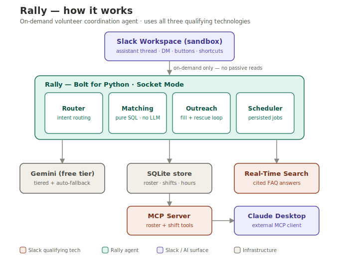

# Rally — the volunteer coordination agent for nonprofits, in Slack

[]()

Nonprofits live in Slack but coordinate volunteers by phone tree and spreadsheet. **Rally**
is a Slack agent that fills shifts by skill and availability, automatically rescues
cancellations, answers volunteer questions with citations, and turns hours into grant-ready
impact reports — all on-demand, at near-zero cost.

Built for the [Slack Agent Builder Challenge](https://slackhack.devpost.com/) · track: **Agent for Good**.



## What it does
- **Fill a shift from plain language** — *"I need 6 volunteers Saturday 9am–1pm, 2 drivers, 1 Spanish speaker"* → matched, invited, tracked on a live status card.
- **Auto-rescue dropouts** — a cancellation re-matches and back-fills in seconds.
- **Negotiate constraints** — proposes trade-offs when a shift can't be filled as asked.
- **Cited answers** — "Where do I park?" via the Slack **Real-Time Search API**.
- **Conversational intake** — a short DM becomes a structured roster entry.
- **Impact ledger over MCP** — roster/coverage/hours queryable from Claude Desktop.

## Qualifying technologies
Real-Time Search API · MCP server (FastMCP) · Slack agent surfaces — **all three**.

## Quick start
See [SETUP.md](SETUP.md) (local run), [DEPLOY.md](DEPLOY.md) (always-on hosting for judging),
and [SUBMISSION.md](SUBMISSION.md) (Devpost copy).

```bash
python -m venv .venv && .venv/Scripts/activate     # Windows: .venv\Scripts\Activate.ps1
pip install -r requirements.txt
python -m seeds.seed_roster        # demo roster
python -m seeds.preflight          # verify credentials + APIs
python -m rally.app                # run (Socket Mode)
```

## Design notes
- **On-demand only** — never scans ambient channel traffic; single-digit cents per filled shift.
- **Bounded autonomy** — the agent proposes; humans confirm every write.
- **Resilient** — retry + cross-model LLM fallback, persisted idempotent job queue, event dedupe.
- **Model-agnostic** — any OpenAI-compatible endpoint; ships on Gemini's free tier.

## Layout
```
rally/     app.py · matching · outreach · negotiate · intake · faq · canvas · scheduler · mcp_server
seeds/     seed_roster · seed_history · preflight · live_test
tests/     matching · e2e simulation · mcp · normalizer  (13 tests)
docs/      architecture.svg
```

## Tests
```bash
python -m pytest tests -q          # 13 unit + e2e (offline, no creds)
python -m seeds.live_test          # 6-check live e2e (server must be running)
```
